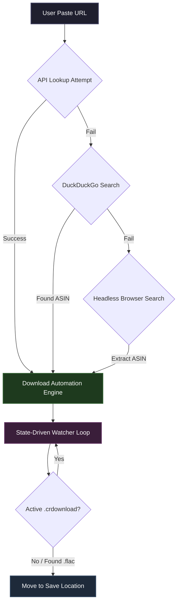

# MusicDownloaderCLI 🎧

A robust, state-driven command-line utility built in Python to automatically resolve, scrape, and download high-fidelity audio streams from music sharing platforms. Utilizing **SeleniumBase**, it automates background interactions, gracefully handles security clearance challenges, and mirrors updates dynamically to local user storage configurations.

---

## ✨ Features

* **Direct API Routing:** Attempts lightning-fast metadata lookup via upstream music catalog APIs before deploying heavier scraper workflows.
* **Resilient Multi-Stage Scraping:** Integrates an advanced DuckDuckGo automation fallback combined with a direct, headless browser search engine if an asset identifier (ASIN) is missing.
* **State-Driven File Monitor:** Implements an optimized `while True` file monitoring snapshot loop tracking local file structures natively—eliminating racing conditions or thread-blocking `time.sleep` traps.
* **Self-Healing Automation:** Automatically catches network stalls or dropped clicks, auto-refreshing the web view and re-initiating security check clearance passes up to a maximum safety threshold.
* **Persistent Local Configurations:** Uses `configparser` to remember user environments, paired with an integrated GUI folder and file picker (`tkinter`) to safely assign custom web browser executables and download pathways.

## 🛠️ Technical Architecture

The architecture relies on a persistent synchronization loop between filesystem states and headless browser runtime actions:



---

## 🚀 Getting Started

### Prerequisites

Ensure you have your preferred browser installed (Google Chrome or Brave Browser) and the Python runtime environment ready on your machine.

### Installation

1. **Clone the repository:**
```bash
git clone https://github.com/GodGamerAgent/Hi-Res-MusicDownloader.git
cd MusicDownloaderCLI 
```   
3. **Install dependencies:**
```bash
pip install -r requirements.txt
```

3. **Initialize the application wrapper**
```bash
python main.py
```

4. **Follow the instruction in the Script** 

---

> [!IMPORTANT]
> Feed only Apple music and Spotify link, Don't feed album or artist or any playlist link it will crash future updates will be given for fixing it. If I am free or fix it your self, Sorry

---


On your absolute first launch, the engine will safely direct you into Config Mode to register your preferred browser executable engine path and default download storage directories using an interactive native desktop folder picker box.

### ⚙️ Configuration File Schema
Your local directory adjustments, runtime tracking variables, and platform paths are synchronized straight down to a local settings.ini initialization map:

**Settings.ini**
```bash
    [parameters]
    launchNumber = 4
    Browser = brave
    location = C:\Program Files\BraveSoftware\Brave-Browser\Application\brave.exe
    saveLocation = E:\MusicDownloader\Complete_Download
```

## 📄 License

This project is licensed under the **GNU Affero General Public License v3 (AGPL-3.0)**. 

### What this means for you:
* **Open Source Over Networks:** If you modify this CLI tool or use its architecture to run a cloud service, web application, or API, you **must** make your modified source code publicly available under the same AGPL-3.0 rules.
* **No Closed-Source Commercialization:** You cannot take this automated backend logic, lock it behind a private web server, and turn it into a proprietary closed-source product.
* **Liability Protection:** This utility is provided completely **"AS IS"** without warranties of any kind. The original author carries zero responsibility or liability for downstream execution, system stalls, or network usage.

For full license details, please refer to the accompanying `LICENSE` file in the root directory.
